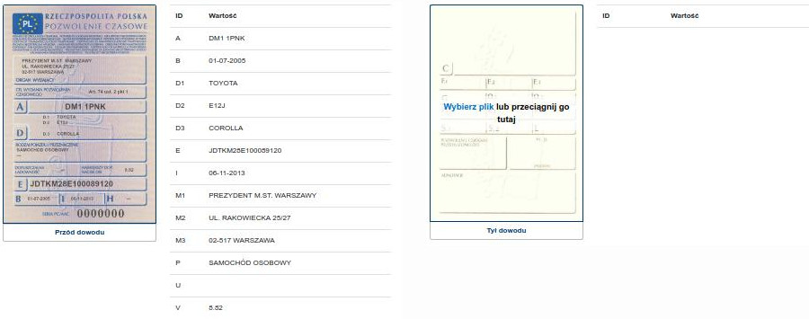

# YesReaderWebClient

[YesReader](https://yesse.eu/yesreader/) to oprogramowanie do odczytywania danych ze zdjęć Dowodów Miękkich niewyposażonych w kody 2D AZTEC. Do przetwarzania zdjęć wykorzystujemy głębokie sieci neuronowe.

W tym repozytorium znajdują się:
* kod javascript do podstawowych transformacji zdjęcia przed wysłaniem do serwisu.
* kod do komunikacji z serwisem (wysłanie zdjęć, odebranie wyników)
* przykład użycia w pliku index.html

Zapytanie do serwisu - POST z form/data z polami:

Key | Type | Value
--- | --- | ---
side | text | 0 or 1
docfile | file | choosen file
source | text | license_key

Jeśli używasz postmana, zaimportuj scheme: https://www.getpostman.com/collections/4e42c6549ca036a2e722

Aby użyć komercyjnie skonktauj się z nami: contact@yesse.eu
